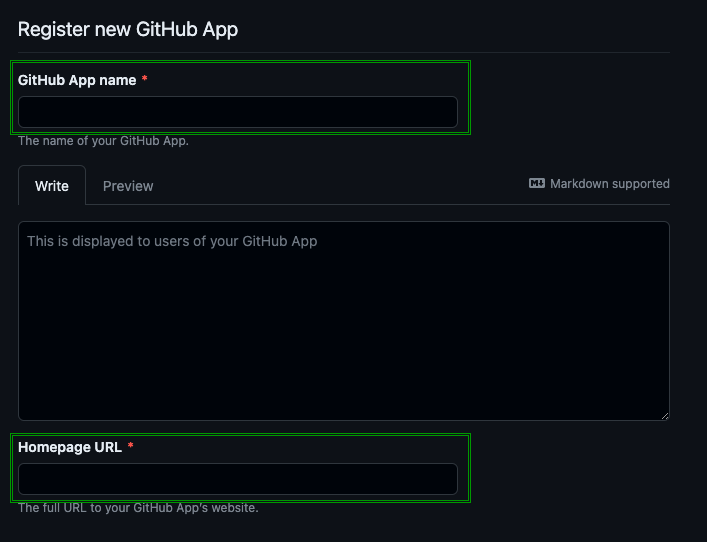

# GitHub App - Base Setup

## Table of Contents
<details>
<summary>Click to expand</summary>

- [GitHub App - Base Setup](#github-app---base-setup)
  - [Table of Contents](#table-of-contents)
  - [Setting context](#setting-context)
    - [Highlevel architecture](#highlevel-architecture)
  - [Prerequisites and assumptions](#prerequisites-and-assumptions)
  - [Solution setup steps](#solution-setup-steps)
    - [1. Create a GitHub App](#1-create-a-github-app)
    - [2. Set base configuration GitHub App](#2-set-base-configuration-github-app)
    - [3. Generate a private key for the GitHub App](#3-generate-a-private-key-for-the-github-app)
    - [4. Deploy Azure resources](#4-deploy-azure-resources)
    - [5. Deploy Azure Function App code](#5-deploy-azure-function-app-code)
    - [6. Update GitHub App webhook URL](#6-update-github-app-webhook-url)
    - [7. Install the GitHub App on your organization](#7-install-the-github-app-on-your-organization)
    - [8. Test the solution](#8-test-the-solution)
  - [Use and setup Postman collection](#use-and-setup-postman-collection)
    - [1. Import the collection](#1-import-the-collection)
    - [2. Update the collection variables for use](#2-update-the-collection-variables-for-use)
- [Additional resources](#additional-resources)

</details>

## Setting context
This repository contains:
- Resources for setting up a working integration solution with GitHub using a basic set of Azure components.
- Providing a sample Azure Function App (PowerShell) which can be used to receive and process GitHub webhooks.
- Sample/test resources for using [Postman](https://www.postman.com/) as an exploration tool.

### Highlevel architecture


## Prerequisites and assumptions
What you'll need to set everything up:
- A GitHub account :smile:
- An organization (where your GitHub account has admin rights)
- An active Azure subscription, where you can deploy resources (minimal Contributor rights)
- (optional) Postman - For testing/exploring
- A machine with Az PowerShell modules installed (we'll use that for the deployment scripts)

```PowerShell

Install-Module Az

```

## Solution setup steps
### 1. Create a GitHub App
Go to your GitHub organization and create a new GitHub App - under '`Settings - Developer Settings`'.




**Notes**
- Enter a unique '`GitHub App Name`' and optionally a '`Description`' for your GitHub App. These will be visible for your GitHub App users.
- Enter a '`Homepage URL`' for your GitHub App. This URL is visible to users of your app.

### 2. Set base configuration GitHub App


1. Set the required '`Webhook URL`' field. We'll update this later on, so for now just enter a dummy URL.
2. Optionally - Set the '`Webhook secret (optional)` field.

> [!WARNING]
> It is highly recommended to set the '`Webhook secret (optional)`' field as well. This can/will be used to validate the webhook payload on the receiving side later on.

> [!TIP]
> For the '`Webhook secret (optional)`' field, you can use the following PowerShell snippet to generate a random string, it will enhance the encryption strength of the webhook payload.
> ```PowerShell
> -join ((65..90) + (97..122) + (48..57) | Get-Random -Count 32 | % {[char]$_})
> ```

Configure the 'Permissions' and the 'Subscribe to events' sections for your GitHub App.
- Check the [additional resources](#additional-resources) and/or function [source code](./src/functions/http-webhook-receive/run.ps1). Check which permissions are used to achieve the desired result.

***Important***
1. We'll update the '`Webhook URL`' later on, so for now just enter a dummy URL.
2. When you set the '`Webhook secret (optional)`', make sure to set it in this step and you copy it somewhere. We'll need it further down the line.

### 3. Generate a private key for the GitHub App


**Note**
Copy the '`App ID`'. We need it further down the line.


Save the private key to a file - securely. We'll need it later on.

### 4. Deploy Azure resources
Connect to the right Azure subscription using your favorite terminal. Use the following commands to make sure you are:

```PowerShell
Connect-AzAccount -Tenant "<your-tenant-ID-here>" -SubscriptionId "<your-subscription-ID-here>"
```

Navigate to the 'deploy' folder in the repository and execute the following command:

```PowerShell
.\1.Deploy-AzResources.ps1 -ResourceGroupName "<your-resource-group-name-here>" -Location "<your-location-here>" -GitHubAppId "<your-github-app-id-here>" -GitHubAppPrivateKeyPath "<your-path-to-the-github-app-private-key-here>" -GitHubAppWebhookSecret "<your-github-app-webhook-secret-here>"
```

*Optional parameters:*
- '`ResourceGroupName`' - defaults to '`github-int-eus-231128`'
- '`Location`' - defaults to '`East US`'
- '`GitHubAppWebhookSecret`' - defaults to empty string

> [!WARNING]
> It is highly recommended to set up webhook payload validation! Use the created and set secret from step [2. Set base configuration GitHub App](#2-set-base-configuration-github-app) to set the '`GitHubAppWebhookSecret`' parameter.

**Important**
Check the output and copy the '`ResourceGroupName`' and '`FunctionAppName`'. These will be required in subsequent steps.

**Sample**


### 5. Deploy Azure Function App code
In the 'deploy' folder, execute the following command, substituting '`ResourceGroupName`' and '`FunctionAppName`' with the values from the previous step:

```PowerShell
.\2.CreateAndReleaseDeploymentPackage.ps1 -ResourceGroupName "<paste-here-your-resource-group-name>" -FunctionAppName "<paste-here-your-generated-function-app-name>"
```

**Important**
Check the output and copy the '`FunctionUrl`'. This will be required in a subsequent step.

**Sample**


### 6. Update GitHub App webhook URL
Return to your GitHub App configuration page and replace the '`Webhook URL`' value with the '`FunctionUrl`' obtained from the previous step.


### 7. Install the GitHub App on your organization
Follow the steps in the GitHub App to install it in your organization. Make sure you have admin rights on the organization, that you select the right organization and that you authorize it to access the right repositories.
See also this [documentation](https://docs.github.com/en/apps/using-github-apps/installing-your-own-github-app) for more information.

**Note**
In the sample below, the GitHub App is created and will be installed in a personal organization.

**Sample**


### 8. Test the solution
Please check the output of the Azure Function App. You can verify if it runs by checking the logs in the Azure Portal. Another way is to go to the GitHub App and check the webhook deliveries.

**Note**
You can use the '`ping`' request to check if everything is setup correctly. If everything **is** setup correctly and working, you'll see a '`pong`' in the response body. You can redeliver that particular message for checking the latest state.


## Use and setup Postman collection
You can use the provided Postman collection to experiment with different API endpoints. This Postman collection only supports calls for:
- Generating an access token for a particular organization.
- Approving/commenting a custom deployment rule.

To make them work, you'll have to do a few steps;

### 1. Import the collection
Please check out this documentation provided by Postman for importing the provided [collection](./docs/postman/github-app-samples.postman_collection.json): [Howto import collection - Postman docs](https://learning.postman.com/docs/getting-started/importing-and-exporting-data/).

### 2. Update the collection variables for use


You'll need to update the following variables:
1. Update the '`Organization-name`' value to point to your target organization name. This is used for additional API calls.
2. The '`Organization-install-id`' value, for which you want to use the GitHub App (this is different from the 'App ID', because it is specific to your installation on your organization). You can find this value by going to the GitHub App and clicking on the 'Installations' tab. Then click on the 'Configure' button for the organization you want to use. The URL will contain the value as shown below in the sample.


3. The '`JwtToken`' value, used for making additional calls and retrieving the right access tokens. You can generate this value by using the provided [Bash script](./src/scripts/github-app-jwt.sh). You'll need to update the following values to make it work (see lines 15-17):
    - The 'App ID' of the GitHub App.
    - The path to the private key file of the GitHub App.
    
This script generates a short-lived JWT token (5 min), which you can use to generate an access token for the organization you want to use. You can find more information about this in the [additional resources](#additional-resources) section.

4. The '`Repo-name`', used for targeting additional API calls to point to the right repository. You can find this value by going to the repository and copying the name.

# Additional resources
- [Building a GitHub App that responds to webhook events](https://docs.github.com/en/apps/creating-github-apps/writing-code-for-a-github-app/building-a-github-app-that-responds-to-webhook-events) - GitHub docs
  - [Best practices for using webhooks](https://docs.github.com/en/webhooks/using-webhooks/best-practices-for-using-webhooks) - GitHub docs
  - [Validating webhook deliveries](https://docs.github.com/en/webhooks/using-webhooks/validating-webhook-deliveries) - GitHub docs
- [Azure Functions PowerShell developer guide](https://learn.microsoft.com/en-us/azure/azure-functions/functions-reference-powershell?tabs=portal) - MSFT Learn docs
- [Authenticating as a GitHub App - Generate a GitHub App JWT token](https://docs.github.com/en/developers/apps/building-github-apps/authenticating-with-github-apps#authenticating-as-a-github-app) - GitHub Docs
- [Create a secure GitHub webhook to trigger an Azure PowerShell Function](https://4bes.nl/2021/04/04/create-a-secure-github-webhook-to-trigger-an-azure-powershell-function/) - External blog
- [Generating an installation access token for a GitHub App](https://docs.github.com/en/apps/creating-github-apps/authenticating-with-a-github-app/generating-an-installation-access-token-for-a-github-app) - GitHub docs
- [GitHub App setup](https://docs.github.com/en/developers/apps/creating-a-github-app) - GitHub docs
- [GitHub App webhook events](https://docs.github.com/en/developers/apps/setting-up-your-development-environment-to-create-a-github-app#webhook-events) - GitHub docs
- [List runners for an organization](https://docs.github.com/en/rest/actions/self-hosted-runners#list-runner-applications-for-an-organization) - GitHub docs
- [Get Repository content](https://docs.github.com/en/rest/repos/contents#get-repository-content) - GitHub docs
- [Approve or reject deployment - Custom Deployment rule](https://docs.github.com/en/actions/deployment/protecting-deployments/creating-custom-deployment-protection-rules#approving-or-rejecting-deployments) - GitHub docs